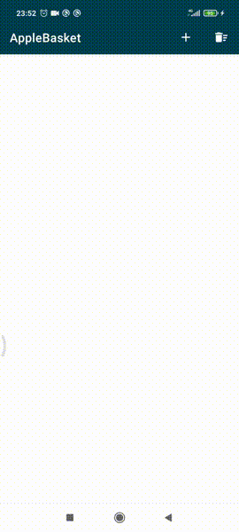
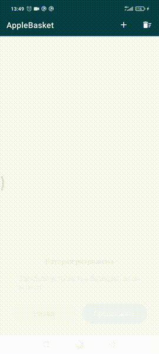

# Apple Basket:apple:
## Превью

## Описание
Список состоит из нескольких типов элементов - **«Корзина», «Яблоко» и «Сумма»**.

На каждом элементе **«Корзина»** имеется иконка ___«Положить яблоко»___. По нажатии на кнопку под текущим элементом **«Корзины»** добавляется элемент - **«Яблоко»**.

**«Яблоко»** содержит текст и иконку ___«Съесть»___. Нажатие на кнопку ___«Съесть»___ удаляет это яблоко из этой корзины. В каждой корзине может быть не больше 3 яблок, при попытке добавить 4-е яблоко выводиться сообщение.

Элемент **«Сумма»** идет последним в списке и содержит текстовое сообщение с общим количеством яблок во всех корзинах в данный момент.

В тулбаре меню имеются кнопки ___«Добавить корзину»___ и ___«Удалить все корзины»___

Для **удаления** яблока из корзины смахните его вправо, а корзины - влево

