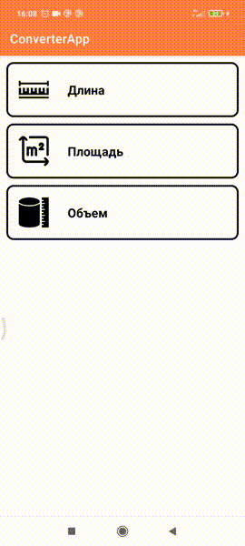

# Converter App
## Превью

## Описание
**Конвертер** для преобразования различных единиц измерения с динамической сменой конвертируемых величин и их значений. 

### Доступные категории: 
- Длина и расстояние - метр, миллиметр, сантиметр, километр
- Площадь - квадратный метр, квадратный миллиметр, квадратный сантиметр, квадратный километр
- Объем - кубический метр, кубический миллиметр, кубический сантиметр, кубический километр

