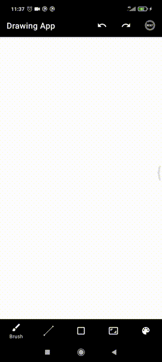
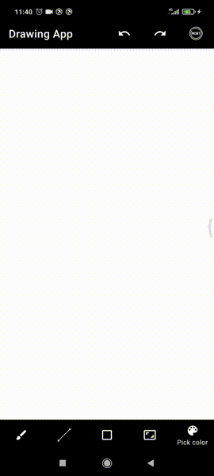
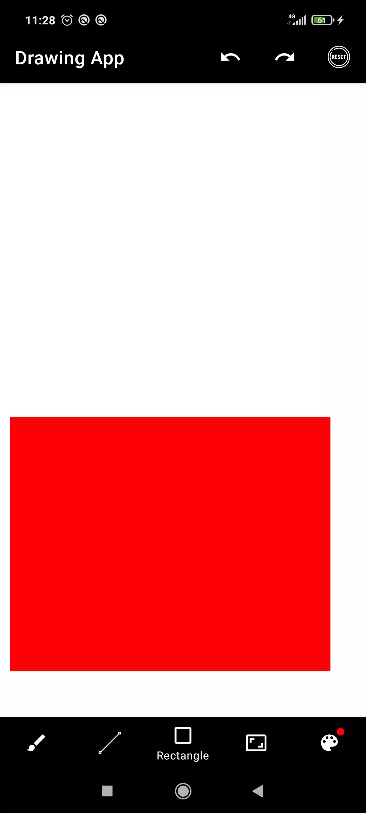

# Drawing App:artist:
## Превью

## Описание
Рисование на холсте в приложении **Drawing App** 
### Доступные возможности: 
- Рисование разных фигур: произвольная линия, прямая линия, прямоугольник
- Менять цвет и его прозрачность
- Масштабируемость холста
- Рисование множественными касаниями
- Возможность отменить, вернуть нарисованный элемент, а так же полностью очистить холст
## Сторонние библиотеки:
- [ColorPickerView](https://github.com/skydoves/ColorPickerView)

## P.S
**Считай, уже неплохо [заработал](http://www.bolshoyvopros.ru/questions/2935200-v-chjom-osobennost-kartiny-njumana-svet-anny-pochemu-ocenili-v-106-mln.html)**

