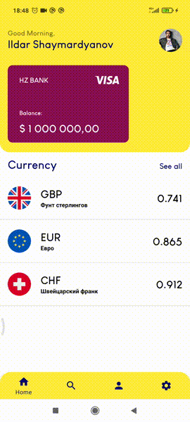
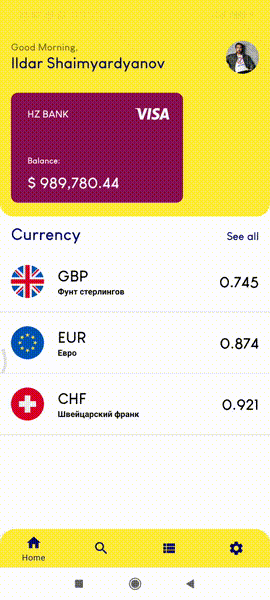

# Currency Operations App
## Превью

## Стэк
- Kotlin
- Single Activity
- MVVM
- Jetpack ViewModel + LiveData
- Jetpack Navigation
- View Binding
- Moshi
- OkHttp
- RxJava3
- Lottie
- Dagger2
- Hilt
- Glide
- Room

## Описание
Приложение для имитации банковских операций по получению курса валют и их покупки. Курс валют обновляется 1 раз в стуки, данные получаем из [API](https://github.com/fawazahmed0/currency-api) 
