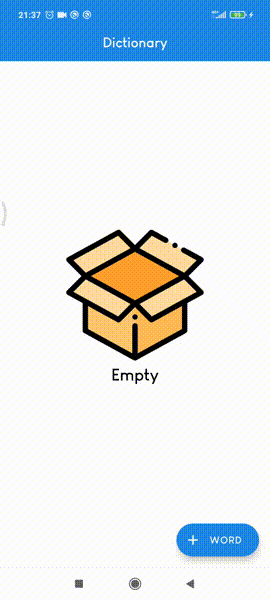

# Deep Link App
## Превью

## Описание
Приложение состоит из 3-х активити:
- **MainActivity**

  > Состоит из полей ввода данных: имени, фамилии и даты рождения, 
  > а также deeplink`а, который формируется динамически в зависимости от вводимых данных.
  > При нажатии на deeplink открывается новый таск с DeepLinkActivity

- **DeepLinkActivity**
  
  > Выводит данные, полученные по deeplink`у
  
- **LinkActivity** 
  > Умеет принимать вопросы с сайта stackoverflow.com/questions, вычленяет id вопроса из ссылки и выполняет запрос в API для получения заголовка

