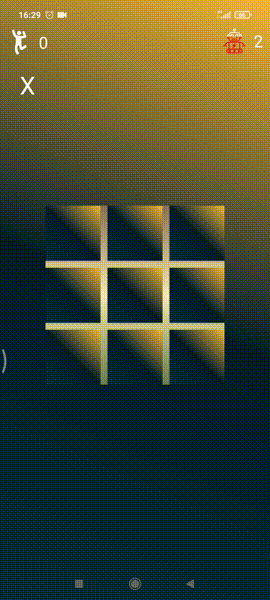
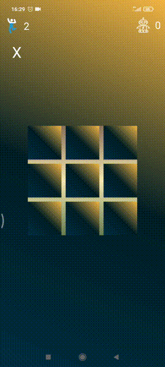

# Tic Tac Toe App
## Превью

## Описание игры
**Крестики-нолики** - это игра с для двух игроков, X и O, которые по очереди отмечают места в сетке 3 × 3. Игрок, которому удастся разместить три своих метки в горизонтальном, вертикальном или диагональном ряду, выигрывает игру.
В данной реализации игры вам придется сыграть с компьютером и определить победителя.

## Описание реализации
- Первым ходит человек и отмечает свободную клетку Крестиком
- Затем с задержкой в 1 секунду  Ноликом ходит компьютер
- После каждого раунда, если известен победитель, отображается диалоговое окно конца раунда
- После 3-х побед человека/компьютера отображается диалоговое окно конца игра с гифкой и идет сброс счетчика побед
